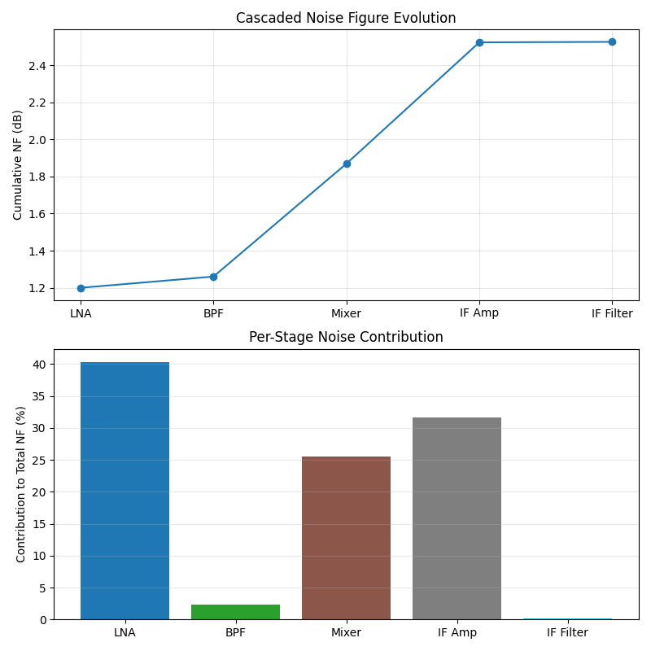

# Noise-Figure-Calculator

Python-based tool for computing the cascaded noise figure (NF) of a multi-stage RF system chain via the Friis equation:

$$F_\text{total} = F_1 + \frac{F_2 - 1}{G_1} + \frac{F_3 - 1}{G_1 G_2} + \cdots$$

Inputs for the script are accepted either interactively (prompted stage-by-stage entry) or via a CSV file. The outputs produced include the total cascaded noise figure as well as two plots showing the cumulative NF evolution across stages and the NF contributed from each stage.

## Repository structure

Noise-Figure-Calculator/
Scripts/
- noise_figure_cascade.py - Main calculator script

Utilities/
- friis.py - Core Friis calculation module (importable)

Outputs/
- nf_cascade_example.png - Example output plot

## Using the Script

### Prompted Mode

python scripts/noise_figure_cascade.py

When run, the script requests the user to select an input mode. In prompted mode, the user enters the number of stages and then provides the name, gain (dB), and noise figure (dB) for each stage one at a time.

### CSV Mode

In prompted mode, the user selects the CSV input option and provide the path to a CSV file in the following format:

```
name,gain_db,nf_db
LNA,15.0,1.5
BPF,-1.5,1.5
Mixer,-7.0,7.0
IF Amp,20.0,3.0
```

- `name` — descriptive label for the component (used in plot axis labels)
- `gain_db` — available gain of the stage in dB (negative values required for lossy components)
- `nf_db` — noise figure of the stage in dB

## Output

Both input modes produce:

- Total cascaded NF printed to the terminal, expressed in dB
- A per-stage table showing cumulative NF and individual stage contribution
- A two-panel plot saved to `Outputs/`:
  - **Top panel:** cumulative cascaded NF as each stage is added (line plot)
  - **Bottom panel:** NF contribution of each individual stage (bar chart)

<p>
  
</p>

## Mixer stages — SSB/DSB note

A passive mixer slots into the chain as a standard stage: enter conversion loss as a negative gain value and use the SSB noise figure from the datasheet (typically equal to conversion loss in dB, plus 3 dB for an unfiltered image band). If an image reject filter precedes the mixer, the image noise contribution is suppressed and the DSB noise figure may be used directly. The Friis calculation is identical regardless of stage type.

A local oscillator does not appear as a stage and is not modelled as it contributes no thermal noise to the cascade in this framework.

## Programmatic use

The core Friis calculation is factored into `utils/friis.py` for use in other scripts:

```python
from utils.friis import compute_cascaded_nf

stages = [
    {"name": "LNA",    "gain_db": 15.0, "nf_db": 1.5},
    {"name": "BPF",    "gain_db": -1.5, "nf_db": 1.5},
    {"name": "Mixer",  "gain_db": -7.0, "nf_db": 7.0},
    {"name": "IF Amp", "gain_db": 20.0, "nf_db": 3.0},
]

result = compute_cascaded_nf(stages)
print(f"Cascaded NF: {result['cascaded_nf_db']:.2f} dB")
```

A `linear=True` keyword is available when inputs are already in linear (power ratio) form rather than dB:

```python
result = compute_cascaded_nf(stages, linear=True)
```

## Dependencies

numpy
matplotlib
pandas

Install:

```bash
pip install numpy matplotlib pandas
```

Tested on Python 3.11
